# ✨ Welcome to Ubden® Development Team's Universe

<div align="center">
  
  

</div>

<div align="center">
  
</div>

---

## 🏢 About Ubden® Corporation


```typescript
const ubdenCorp = {
    name: "Ubden® Development Team",
    type: "Corporate Development Division",
    regions: {
        turkeyBalkans: "Ubden® Teknoloji Anonim Şirketi",
        usa: "Ubden® LLC", 
        europe: "Ubden® OU"
    },
    mission: "Innovation Through Technology",
    focus: ["Enterprise Solutions", "Cloud Infrastructure", "Cybersecurity"],
    philosophy: "Code with precision, innovate with purpose",
    established: "Global Technology Solutions Provider"
};
```

<br clear="right"/>

---

## 🌐 Connect With Ubden®

<div align="center">

[](https://www.linkedin.com/company/ubden)
[](https://t.me/ubden)
[](https://instagram.com/ubden)
[](https://facebook.com/ubden)
[](https://twitter.com/ubden)
[](https://www.hackerrank.com/ubden)


</div>

---

## 👥 Ubden® Development Team

<div align="center">

| Role | Team Member | Expertise | Profile |
|------|-------------|-----------|---------|
| 📊 **Project Manager**  | Strategic Planning & Team Leadership | [](https://github.com/ck-cankurt) |
| 🚀 **Software Engineer** | Full Stack Development & Architecture | [](https://github.com/kemalincekara) |
| 📱 **Senior Developer**  | Mobile App & AI Solutions | [](https://github.com/CanerDedeoglu) |
| 🛡️ **Security Engineer** | Cyber Security & SOC Analyst | [](https://ubden.com) |
| 🨠**Frontend Developer** | UI/UX & Modern Frontend Solutions | [](https://github.com/ruslancik) |
| 🔧 **PHP Developer** | Backend Development & API Design | [](https://ubden.com) |
| 🏗️ **Technical Senior** | System Architecture & Technical Leadership | [](https://ubden.com) |
| ⚙️ **Technical Senior** | System Architecture & DevOps Leadership | [](https://ubden.com) |

</div>

---

## 🛠️ Ubden® Tech Stack

### 💻 Programming Languages
<div align="center">


</div>

### 🚀 Frameworks & Libraries
<div align="center">


</div>

### ☁️ Cloud & DevOps
<div align="center">


</div>

### 🛢️ Databases
<div align="center">


</div>

### 🛠️ Development Tools
<div align="center">


</div>

---

## 🎯 Ubden® Featured Projects

<div align="center">

### 🌐 **Enterprise Applications**

<table>
<tr>
<td align="center" width="50%">

**🏢 Ubden® Corporate Platform**
<br>
[](https://www.ubden.com)
<br>
*Enterprise-grade corporate management system*

</td>
<td align="center" width="50%">

**⚡ Coff.dev Framework**
<br>
[](https://coff.dev/)
<br>
*Custom PHP framework for enterprise development*

</td>
</tr>
<tr>
<td align="center" width="50%">

**🤖 ResteChef AI**
<br>
[](https://play.google.com/store/apps/details?id=com.restechef.app)
<br>
*AI-powered restaurant management solution*

</td>
<td align="center" width="50%">

**📊 Sroject Management**
<br>
[](https://sroject.ruy.app)
<br>
*Advanced project management platform*

</td>
</tr>
</table>

### 💳 **Fintech & Utilities**

<table>
<tr>
<td align="center" width="33%">

**💰 Iyzico Integration**
<br>
[](https://pay.ubd.one)
<br>
*Secure payment processing system*

</td>
<td align="center" width="33%">

**🔗 UBD.one Shortener**
<br>
[](https://ubd.one/)
<br>
*Enterprise link management*

</td>
<td align="center" width="33%">

**📱 Ruy.app Library**
<br>
[](https://ruy.app)
<br>
*Mobile application ecosystem*

</td>
</tr>
</table>

### 🛡️ **Security & Research Tools**

<table>
<tr>
<td align="center" width="33%">

**🔍 Security Research**
<br>
[](https://ipublic.cc/)
<br>
*Cybersecurity assessment tools*

</td>
<td align="center" width="33%">

**🌊 Network Tools**
<br>
[](https://github.com/ubden/SYN-Flood)
<br>
*Network testing utilities*

</td>
<td align="center" width="33%">

**☁️ Cloud Monitor**
<br>
[](https://ubd.one/ucloudmonitor)
<br>
*Infrastructure monitoring*

</td>
</tr>
</table>

</div>

---

## 📊 Development Team Statistics

<div align="center">


</div>

<div align="center">
  


</div>

---

## 🏆 Team Achievements

<div align="center">

[](https://github.com/ubden)

</div>

---

## 📈 Contribution Activity

<div align="center">

[](https://github.com/ubden)

</div>

---

## 💡 Development Philosophy

<div align="center">

*"Innovation is not about saying yes to everything. It's about saying no to all but the most crucial features."*


</div>

---

## 🎯 Ubden® 2025 Roadmap

```mermaid
graph TD
    A[🚀 Ubden® 2025 Vision] --> B[🤖 AI Integration]
    A --> C[☁️ Cloud Excellence]
    A --> D[🔒 Security First]
    A --> E[🌍 Global Expansion]
    
    B --> B1[Machine Learning Solutions]
    B --> B2[AI-Powered Applications]
    
    C --> C1[Multi-Cloud Architecture]
    C --> C2[Serverless Solutions]
    
    D --> D1[Zero Trust Security]
    D --> D2[Advanced Threat Protection]
    
    E --> E1[International Markets]
    E --> E2[Enterprise Partnerships]
    
    style A fill:#00D9FF,stroke:#ffffff,stroke-width:2px,color:#000000
    style B fill:#FF6B6B,stroke:#ffffff,stroke-width:2px,color:#ffffff
    style C fill:#4ECDC4,stroke:#ffffff,stroke-width:2px,color:#ffffff
    style D fill:#45B7D1,stroke:#ffffff,stroke-width:2px,color:#ffffff
    style E fill:#96CEB4,stroke:#ffffff,stroke-width:2px,color:#ffffff
```

<div align="center">



</div>

---

## 📧 Contact Ubden®

<div align="center">

**🌟 "Technology is best when it brings people together" - Matt Mullenweg**

### Corporate Offices

**🇹🇷 Turkey & Balkans**  
Ubden® Teknoloji Anonim Şirketi

**🇺🇸 United States**  
Ubden® LLC

**🇪🇺 Europe**  
Ubden® OU

---

[](mailto:info@ubden.com)
[](https://ubden.com)
[](https://ubden.com/careers)

---

**⭐ Star our repositories to stay updated with Ubden® innovations! ⭐**

---


**© 2025 Ubden® - Building Tomorrow's Technology Today! 🚀**

</div>
