# ✨ Welcome to UBDEN's Digital Universe

<div align="center">
  
  

</div>

<div align="center">
  
</div>

---

## 🌟 About Me


```typescript
const ubden = {
    name: "UBDEN Team",
    role: "Full Stack Development & Innovation",
    location: "🌍 Global",
    focus: ["Web Development", "Cloud Solutions", "Cybersecurity"],
    currentlyLearning: ["AI/ML", "Blockchain", "Quantum Computing"],
    philosophy: "Code with passion, innovate with purpose",
    askMeAbout: ["Tech", "Innovation", "Digital Transformation"],
    funFact: "We turn coffee into code and ideas into reality ☕→💻"
};
```

<br clear="right"/>

---

## 🚀 Connect With Our Universe

<div align="center">

[](https://www.linkedin.com/company/ubden)
[](https://t.me/ubden)
[](https://instagram.com/ubden)
[](https://facebook.com/ubden)
[](https://twitter.com/ubden)
[](https://www.hackerrank.com/ubden)


</div>

---

## 👥 Our Dream Team

<div align="center">

| Role | Name | Expertise | GitHub |
|------|------|-----------|--------|
| 🎯 **Project Manager** | Can Kurt | Strategic Planning & Team Leadership | [](https://github.com/ck-cankurt) |
| 💻 **Software Engineer** | Kemal İncekara | Full Stack Development | [](https://github.com/kemalincekara) |
| 🎨 **Frontend Developer** | Ruslan Bairomov | UI/UX & Frontend Magic | [](https://github.com/ruslancik) |
| ⚡ **Electrical Engineer** | Serdar Ulu | Hardware & IoT Solutions | [](https://ubden.com) |
| 🐘 **PHP Developer** | Semiz | Backend Development | [](https://ubden.com) |
| 🛠️ **Technical Senior** | Hüseyin Karaca | Architecture & Mentoring | [](https://ubden.com) |

</div>

---

## 🛠️ Tech Arsenal

### 💻 Programming Languages
<div align="center">


</div>

### 🚀 Frameworks & Libraries
<div align="center">


</div>

### ☁️ Cloud & DevOps
<div align="center">


</div>

### 🛢️ Databases
<div align="center">


</div>

### 🛠️ Tools & Platforms
<div align="center">


</div>

---

## 🎯 Featured Projects

<div align="center">

### 🌐 **Production Applications**

<table>
<tr>
<td align="center" width="50%">

**🏢 UBDEN Corporate**
<br>
[](https://www.ubden.com)
<br>
*Modern corporate website with advanced features*

</td>
<td align="center" width="50%">

**⚡ Coff.dev Framework**
<br>
[](https://coff.dev/)
<br>
*Lightweight PHP framework for rapid development*

</td>
</tr>
<tr>
<td align="center" width="50%">

**🤖 ResteChef AI**
<br>
[](https://play.google.com/store/apps/details?id=com.restechef.app)
<br>
*AI-powered restaurant management system*

</td>
<td align="center" width="50%">

**📊 Sroject Management**
<br>
[](https://sroject.ruy.app/?controller=AuthController&action=login)
<br>
*Advanced project management platform*

</td>
</tr>
</table>

### 💳 **Fintech Solutions**

<table>
<tr>
<td align="center" width="50%">

**💰 Iyzico Payment Gateway**
<br>
[](https://pay.ubd.one/login.php)
<br>
*Secure payment processing system*

</td>
<td align="center" width="50%">

**🔗 UBD.one URL Shortener**
<br>
[](https://ubd.one/)
<br>
*Advanced link management platform*

</td>
</tr>
</table>

### 🛡️ **Security & Research Projects**

<table>
<tr>
<td align="center" width="33%">

**🩸 iPublic.cc**
<br>
[](https://ipublic.cc/)
<br>
*Vulnerability assessment tool*

</td>
<td align="center" width="33%">

**🌊 SYN Flood Tool**
<br>
[](https://github.com/ubden/SYN-Flood)
<br>
*Network testing utility*

</td>
<td align="center" width="33%">

**☁️ uCloud Monitor**
<br>
[](https://ubd.one/ucloudmonitor)
<br>
*Cloud infrastructure monitoring*

</td>
</tr>
</table>

</div>

---

## 📊 GitHub Analytics

<div align="center">


</div>

<div align="center">
  


</div>

<div align="center">

[](https://github.com/ubden)

</div>

---

## 🏆 Achievements & Certifications

<div align="center">


</div>

---

## 🎵 Currently Vibing To

<div align="center">

[](https://open.spotify.com/user/username)

</div>

---

## 📈 Contribution Graph

<div align="center">


</div>

---

## 💡 Random Dev Quote

<div align="center">


</div>

---

## 🎯 2025 Goals

```mermaid
graph TD
    A[🚀 Innovation Goals 2025] --> B[🤖 AI Integration]
    A --> C[☁️ Cloud Architecture]
    A --> D[🔒 Cybersecurity]
    A --> E[🌍 Global Expansion]
    
    B --> B1[Machine Learning Projects]
    B --> B2[AI-Powered Applications]
    
    C --> C1[Serverless Architecture]
    C --> C2[Multi-Cloud Solutions]
    
    D --> D1[Zero Trust Security]
    D --> D2[Threat Intelligence]
    
    E --> E1[International Partnerships]
    E --> E2[Open Source Contributions]
```

<div align="center">



</div>

---

## 📫 Let's Collaborate!

<div align="center">

**🌟 "Innovation distinguishes between a leader and a follower" - Steve Jobs**

[](mailto:contact@ubden.com)
[](https://ubden.com)
[](https://ubden.com/portfolio)

---

**⭐ If you find our work interesting, consider giving us a star! ⭐**

---


**Thank you for visiting! Let's build the future together! 🚀**

</div>
